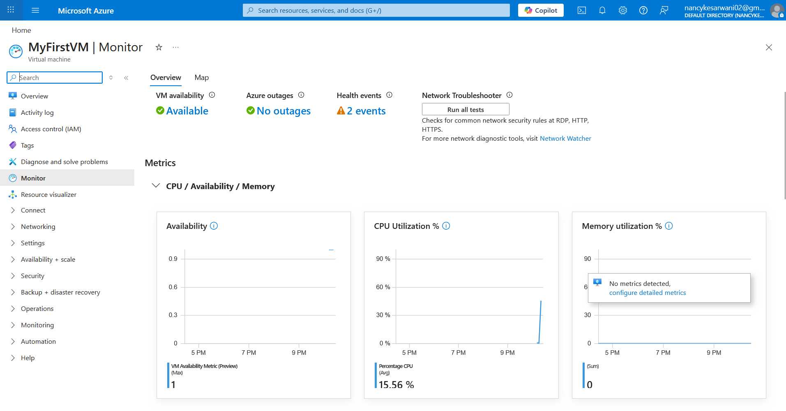
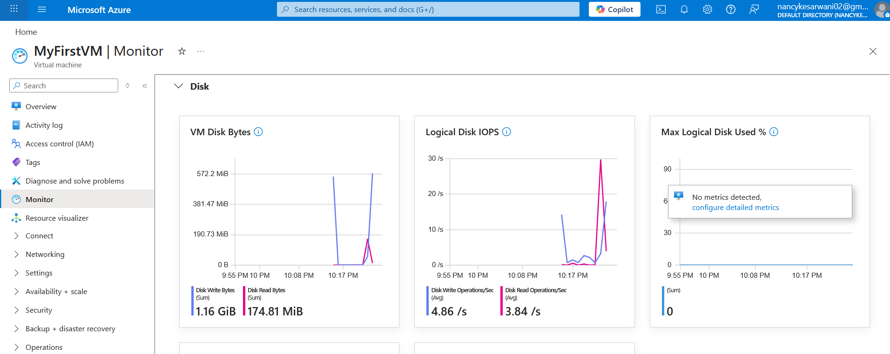
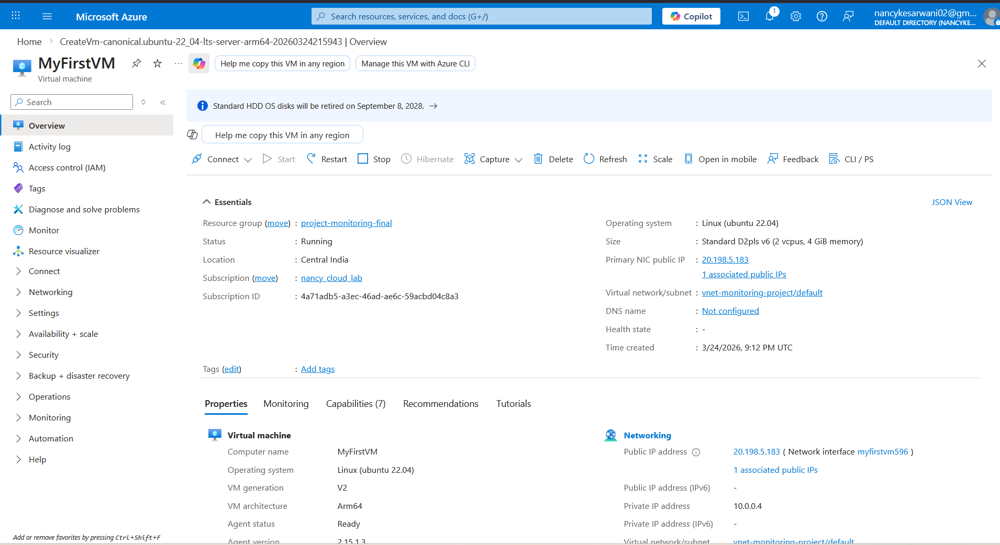
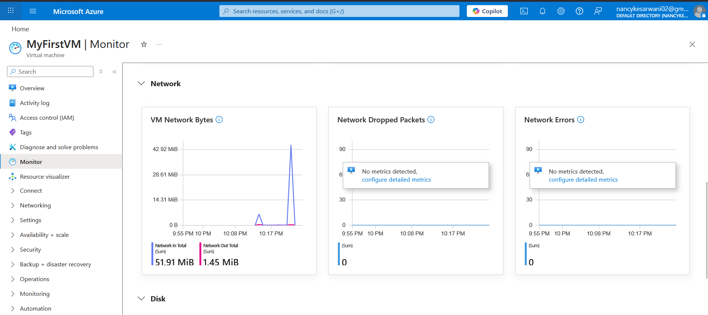

# Azure-VM-Monitoring-Lab
# Azure ARM VM Monitoring & Stress Testing
This project demonstrates the deployment of an ARM-based Virtual Machine in Azure and the configuration of real-time monitoring alerts.
## Tech Stack
* **Cloud:** Microsoft Azure
* **OS:** Ubuntu 22.04 LTS (Arm64)
* **Instance:** Standard_D2pls_v6 (Central India)
* **Tools:** Azure Monitor, Linux `stress` utility
## Implementation Steps
1. Provisioned an ARM64 VM to optimize cost-to-performance ratio.
2. Configured Network Security Groups (NSG) for secure SSH access.
3. Implemented Azure Metric Alerts for CPU utilization thresholds.
4. Executed a synthetic load test to validate the alerting pipeline.
## Results
Below is the telemetry data showing the CPU spike and the subsequent alert firing:

